# Plano do harness de IA

## Objetivo

Construir um fluxo rápido, preciso e controlado para transformar áudio ou texto em entidades do sistema.

O fluxo terá duas chamadas de LLM depois da transcrição:

1. Organizar a transcrição em Markdown editável.
2. Transformar o Markdown aprovado em uma proposta definitiva de entidades.

## Contratos já definidos

- [x] A transcrição é uma etapa isolada e não consulta projetos, contextos, tags ou dicionários.
- [x] A primeira chamada de LLM produz Markdown organizado e resumido.
- [x] O Markdown será editado visualmente, com experiência semelhante a Notion ou Markdown renderizado do GitHub.
- [x] O usuário pode editar, excluir e adicionar informações antes da primeira aprovação.
- [x] O Markdown aprovado é a única fonte autoritativa de intenção e conteúdo novo para a segunda chamada.
- [x] A transcrição original não é enviada novamente para a segunda chamada.
- [x] Haverá duas aprovações: uma do Markdown e outra do preview final.
- [x] `Task`, `Note`, `Meeting` e `Milestone` são entidades separadas.
- [x] Card é apenas o componente visual compartilhado entre essas entidades.
- [x] Contextos e tags apoiam classificações futuras, mas não são a saída principal.
- [x] Correções do usuário alimentam aprendizado futuro.
- [x] Uma conversão entre entidades preserva rastreabilidade e histórico.
- [ ] Confirmar se busca híbrida ou vetorial entrará na primeira versão.

## Fluxo acordado

```mermaid
flowchart LR
    A["Áudio ou texto"] --> B["Transcrição"]
    B --> C["LLM 1: organizar"]
    C --> D["Markdown visual e editável"]
    D --> E["Aprovação 1: conteúdo"]
    E --> F["Referências opcionais"]
    F --> G["LLM 2: proposta definitiva"]
    G --> H["Preview dos cards"]
    H --> I["Aprovação 2: entidades"]
    I --> J["Validação e execução"]
    J --> K["Correções e aprendizado"]
```



---

## Fase 0 — Contratos, estados e testes de aceitação

### Comportamentos protegidos

- Duas chamadas de LLM, sem terceira etapa de raciocínio escondida.
- Duas aprovações humanas antes da escrita definitiva.
- Conteúdo removido do Markdown não reaparece.
- Conteúdo adicionado pelo usuário possui mesma autoridade que conteúdo produzido pelo LLM 1.
- Nenhuma entidade é criada antes da aprovação do preview final.
- Busca externa, quando existir, não cria informação ausente do Markdown.

### TODO

- [ ] Definir estados persistidos do fluxo.
- [ ] Definir transições permitidas entre os estados.
- [ ] Definir contrato de erro e retry de cada etapa.
- [ ] Definir regra para retomar processamento interrompido.
- [ ] Definir idempotência das duas chamadas e da execução final.
- [ ] Definir versionamento dos prompts.
- [ ] Definir schema da proposta definitiva.
- [ ] Criar testes de aceitação antes da implementação.

### Estados propostos para discussão

```text
RECEIVED
TRANSCRIBING
TRANSCRIBED
ORGANIZING
AWAITING_MARKDOWN_APPROVAL
PREPARING_REFERENCES
MATERIALIZING
AWAITING_ENTITY_APPROVAL
EXECUTING
PROCESSED
ERROR
DISCARDED
```

### Casos de teste mínimos

- [ ] Áudio com uma task simples.
- [ ] Áudio com várias tasks.
- [ ] Reunião com data e tasks relacionadas.
- [ ] Nota importante sem ação executável.
- [ ] Marco com data esperada.
- [ ] Conteúdo com entidades de projetos diferentes.
- [ ] Tópico ambíguo.
- [ ] Task possivelmente duplicada.
- [ ] Usuário remove tópico antes da primeira aprovação.
- [ ] Usuário adiciona tópico manualmente no Markdown.
- [ ] Usuário troca `Task` por `Note` no preview.
- [ ] Falha da primeira chamada sem perda da transcrição.
- [ ] Falha da segunda chamada sem perda do Markdown aprovado.
- [ ] Segunda aprovação repetida sem criar entidades duplicadas.

---

## Fase 1 — Persistência do fluxo

### TODO

- [ ] Preservar transcrição original separadamente.
- [ ] Persistir Markdown gerado pelo LLM 1.
- [ ] Persistir Markdown editado pelo usuário.
- [ ] Criar snapshot imutável do Markdown na primeira aprovação.
- [ ] Registrar hash e versão do snapshot aprovado.
- [ ] Persistir proposta bruta e proposta validada do LLM 2.
- [ ] Persistir versão editada e aprovada no segundo preview.
- [ ] Relacionar cada entidade criada com item de entrada e snapshot de origem.
- [ ] Registrar autoria de cada alteração: IA ou usuário.
- [ ] Garantir isolamento por proprietário em todas as consultas.

### Critério de aceite

- [ ] Reload da página não perde transcrição, Markdown, proposta ou estado atual.
- [ ] Retry reutiliza snapshot correto e não versão antiga.
- [ ] Alteração posterior não modifica snapshot já aprovado.

---

## Fase 2 — Transcrição

### Regra

Transcrição produz apenas texto. Nenhuma classificação ou consulta contextual ocorre aqui.

### TODO

- [ ] Receber áudio validado.
- [ ] Armazenar áudio temporariamente.
- [ ] Transcrever áudio.
- [ ] Salvar texto original da transcrição.
- [ ] Excluir áudio temporário após processamento conforme política de retenção.
- [ ] Permitir retry seguro quando provedor falhar.
- [ ] Mostrar erro recuperável ao usuário.
- [ ] Registrar provedor, modelo, duração e latência sem expor conteúdo sensível nos logs.

### Critério de aceite

- [ ] Transcrição não recebe projeto, contexto, tag, task ou nota.
- [ ] Áudio não permanece armazenado além da política definida.
- [ ] Falha não apaga texto ou estado já persistido.

---

## Fase 3 — Primeira chamada: organização em Markdown

### Entrada

- Transcrição original.
- Data atual.
- Fuso horário.

### Saída

- Markdown limpo, resumido e dividido em tópicos.
- Datas mencionadas preservadas.
- Nomes e termos originais preservados.
- Um assunto principal por tópico sempre que possível.
- Nenhuma entidade criada.

### TODO

- [ ] Criar prompt específico do organizador.
- [ ] Proibir invenção de projeto, prazo, pessoa ou decisão.
- [ ] Proibir consulta a contexto de negócio.
- [ ] Definir padrão simples de títulos e listas Markdown.
- [ ] Preservar informação importante mesmo quando não for task.
- [ ] Separar reuniões, notas, marcos e tasks em tópicos claros.
- [ ] Permitir tópico neutro quando tipo não estiver claro.
- [ ] Validar que saída é Markdown não vazio.
- [ ] Testar transcrições longas, repetitivas e desorganizadas.
- [ ] Testar datas relativas usando data e fuso informados.

### Critério de aceite

- [ ] Markdown fica legível sem mostrar sintaxe crua ao usuário.
- [ ] Nenhum fato ausente na transcrição é adicionado pelo modelo.
- [ ] Tópicos importantes não são eliminados pelo resumo.

---

## Fase 4 — Editor visual e primeira aprovação

### Regra

Interface mostra Markdown renderizado e editável. Versão confirmada passa a ser autoridade da segunda chamada.

### TODO

- [ ] Escolher e componentizar editor WYSIWYG com armazenamento em Markdown.
- [ ] Permitir títulos, listas, checklist, negrito e links.
- [ ] Permitir adicionar, editar, dividir, unir e excluir tópicos.
- [ ] Disponibilizar visualização separada da transcrição original.
- [ ] Manter autosave do rascunho.
- [ ] Avisar sobre alterações ainda não salvas.
- [ ] Criar ação `Aprovar Markdown`.
- [ ] Congelar snapshot confirmado.
- [ ] Impedir que edição posterior altere job já iniciado.
- [ ] Permitir criar nova revisão se usuário quiser mudar conteúdo aprovado.

### Critério de aceite

- [ ] Texto removido não chega à segunda chamada.
- [ ] Texto adicionado chega integralmente à segunda chamada.
- [ ] Segunda chamada usa exatamente snapshot aprovado.

---

## Fase 5 — Busca híbrida ou vetorial opcional

### Regra

Markdown continua única fonte de intenção e conteúdo novo. Resultados recuperados são apenas referências existentes.

### Decisão pendente

- [ ] Confirmar se fase entra no primeiro release.
- [ ] Confirmar quais entidades podem ser indexadas.
- [ ] Confirmar provedor de embeddings.
- [ ] Confirmar se busca roda sempre ou somente quando correspondência exata falhar.

### Conteúdo elegível proposto

- Projetos.
- Aliases.
- Módulos.
- Tags.
- Tasks existentes.
- Marcos.
- Contextos aprovados.
- Correções anteriores.

### Conteúdo proibido

- Notas privadas.
- Áudio temporário.
- Segredos.
- Dados de outro proprietário.

### TODO técnico, se aprovado

- [ ] Criar busca exata por nome, alias, tag e módulo.
- [ ] Criar full-text search no PostgreSQL.
- [ ] Avaliar `pgvector` no Neon.
- [ ] Gerar embeddings em lote para tópicos do Markdown aprovado.
- [ ] Pré-calcular embeddings das referências existentes.
- [ ] Atualizar embeddings quando conteúdo indexado mudar.
- [ ] Filtrar sempre por proprietário.
- [ ] Combinar busca textual e vetorial.
- [ ] Limitar quantidade de candidatos enviados ao LLM 2.
- [ ] Marcar candidatos como `REFERENCE_ONLY`.
- [ ] Exigir evidência do Markdown para qualquer conteúdo criado.
- [ ] Medir recall e latência antes de adicionar índice aproximado.

### Critério de aceite

- [ ] Referência recuperada pode definir vínculo, nunca conteúdo novo.
- [ ] Informação ausente no Markdown não vira entidade.
- [ ] Informação excluída pelo usuário não reaparece por causa da busca.
- [ ] Nota privada nunca entra em embedding ou prompt.

---

## Fase 6 — Segunda chamada: proposta definitiva

### Entrada autoritativa

- Snapshot do Markdown aprovado.

### Entrada auxiliar opcional

- Referências recuperadas e marcadas como somente leitura.
- Data atual e fuso horário.
- Schema de saída.

### Regra

Cada tópico gera uma entidade principal ou um resultado `UNRESOLVED`. Modelo não escreve no banco.

### Entidades principais

- `Task`.
- `Meeting`.
- `Note`.
- `Milestone`.

### TODO

- [ ] Criar schema discriminado por entidade.
- [ ] Permitir exatamente uma entidade principal por tópico.
- [ ] Permitir `UNRESOLVED` sem obrigar modelo a inventar.
- [ ] Exigir trecho de evidência do Markdown em cada entidade.
- [ ] Exigir confiança separada para tipo, projeto e datas.
- [ ] Resolver projeto existente somente por referência válida.
- [ ] Sugerir prioridade, complexidade, prazo, previsão, tags e marcos para tasks.
- [ ] Sugerir data, horário, projeto e link para reuniões.
- [ ] Manter notas privadas por padrão.
- [ ] Sugerir datas, status e vínculos para marcos.
- [ ] Detectar possíveis duplicidades.
- [ ] Validar JSON antes de persistir proposta.
- [ ] Definir retry técnico sem criar terceira etapa semântica.

### Critério de aceite

- [ ] Modelo não cria entidade baseada somente em referência recuperada.
- [ ] Modelo não usa transcrição original.
- [ ] Modelo não usa versão anterior do Markdown.
- [ ] Saída inválida não chega ao executor.

---

## Fase 7 — Preview visual e segunda aprovação

### Regra

Preview usa os mesmos componentes visuais dos cards reais, mas ainda não grava entidades definitivas.

### Preview de `Task`

- Título.
- Descrição.
- Projeto.
- Tipo.
- Status.
- Prioridade.
- Complexidade.
- Prazo.
- Previsão.
- Marcos.
- Tags.
- Dependências.

### Preview de `Meeting`

- Título.
- Descrição.
- Projeto opcional.
- Data.
- Horário.
- Link opcional.

### Preview de `Note`

- Título.
- Conteúdo.
- Projeto.
- Task vinculada opcional.
- Privacidade.

### Preview de `Milestone`

- Nome.
- Descrição.
- Projeto.
- Data inicial.
- Data prevista.
- Status.
- Tasks vinculadas.

### TODO

- [ ] Criar card visual compartilhado e variações por entidade.
- [ ] Permitir editar todos os campos relevantes.
- [ ] Permitir trocar tipo antes da criação.
- [ ] Permitir selecionar ou remover cada proposta.
- [ ] Preservar dependências entre itens selecionados.
- [ ] Destacar campos incertos ou ausentes.
- [ ] Mostrar evidências e confiança sem esconder campos principais.
- [ ] Mostrar duplicidades antes da aprovação.
- [ ] Criar ação única `Aprovar e criar`.
- [ ] Registrar diferenças entre proposta da IA e versão aprovada.

### Critério de aceite

- [ ] Nenhuma entidade é criada antes de `Aprovar e criar`.
- [ ] Preview corresponde ao card que aparecerá no sistema.
- [ ] Alterações do usuário são executadas, não proposta antiga.

---

## Fase 8 — Validação e execução

### TODO

- [ ] Validar propriedade de projetos e entidades relacionadas.
- [ ] Validar campos obrigatórios por tipo.
- [ ] Validar datas e relações.
- [ ] Validar que marcos pertencem ao mesmo projeto da task.
- [ ] Validar dependências entre tasks.
- [ ] Executar plano aprovado em transação.
- [ ] Garantir idempotência da segunda aprovação.
- [ ] Criar entidades separadas nas tabelas corretas.
- [ ] Relacionar entidades ao tópico e snapshot de origem.
- [ ] Registrar auditoria da criação.
- [ ] Retornar resultado parcial somente quando regra permitir.
- [ ] Reverter toda transação quando plano atômico falhar.

### Critério de aceite

- [ ] Clique repetido não duplica entidades.
- [ ] Referência de outro usuário é rejeitada antes de qualquer escrita.
- [ ] Falha no meio não deixa metade do plano gravada.

---

## Fase 9 — Conversão e aprendizado com correções

### Regra

Entidades continuam separadas. Trocar tipo significa converter entidade preservando origem e histórico.

### TODO

- [ ] Implementar conversão `Task -> Note`.
- [ ] Definir demais conversões permitidas.
- [ ] Arquivar representação anterior no histórico.
- [ ] Copiar somente campos compatíveis.
- [ ] Preservar tópico e snapshot de origem.
- [ ] Registrar tipo sugerido e tipo final.
- [ ] Registrar projeto, marcos, prioridade e complexidade corrigidos.
- [ ] Transformar correções aprovadas em exemplos de classificação futura.
- [ ] Evitar generalização automática de uma correção isolada.
- [ ] Permitir consultar e remover aprendizado incorreto.
- [ ] Manter correções sensíveis fora de prompts futuros quando necessário.

### Critério de aceite

- [ ] Conversão não perde rastreabilidade.
- [ ] Correção futura relevante melhora sugestão sem alterar conteúdo do Markdown.
- [ ] Aprendizado não expõe notas privadas.

---

## Fase 10 — Precisão, velocidade e observabilidade

### Estratégia de modelos

- LLM 1 rápido, com thinking desligado.
- LLM 2 mais forte, responsável pela decisão definitiva.
- Nenhum terceiro modelo avaliador no fluxo normal.
- Embedding, se usado, é etapa de recuperação e não nova iteração semântica.

### TODO

- [ ] Criar conjunto de evals com entradas reais anonimizadas.
- [ ] Rodar múltiplas tentativas por caso para medir variação.
- [ ] Medir precisão por tipo de entidade.
- [ ] Medir projeto atribuído incorretamente.
- [ ] Medir duplicidades não detectadas.
- [ ] Medir campos alterados na segunda revisão.
- [ ] Medir conversões feitas depois da criação.
- [ ] Medir taxa de `UNRESOLVED`.
- [ ] Medir latência p50 e p95 de cada etapa.
- [ ] Medir tokens de entrada e saída.
- [ ] Medir cache hit do provedor.
- [ ] Medir falhas de schema e retries.
- [ ] Registrar modelo e versão do prompt em cada proposta.
- [ ] Comparar modelos e configurações antes de trocar produção.
- [ ] Definir metas somente após obter baseline real.

### Critério de aceite

- [ ] Mudança de prompt ou modelo roda evals antes da promoção.
- [ ] Resultado é avaliado pelo estado final criado, não somente pelo texto do modelo.
- [ ] Regressão de precisão ou latência bloqueia promoção.

---

## Fora de escopo deste harness inicial

- Multiagentes.
- Autonomia irrestrita.
- Escrita direta do modelo no banco.
- Ferramentas de escrita durante análise.
- Terceira chamada de LLM para revisar a segunda.
- Uso da transcrição original na segunda chamada.
- Uso de notas privadas como contexto ou embedding.
- Criação sem segunda aprovação.

## Ordem recomendada de execução

1. Fase 0 — contratos e testes.
2. Fase 1 — persistência.
3. Fase 2 — transcrição.
4. Fase 3 — organizador Markdown.
5. Fase 4 — editor e primeira aprovação.
6. Decidir entrada da Fase 5.
7. Fase 6 — proposta definitiva.
8. Fase 7 — preview e segunda aprovação.
9. Fase 8 — executor.
10. Fase 9 — correções e aprendizado.
11. Fase 10 — otimização contínua.

